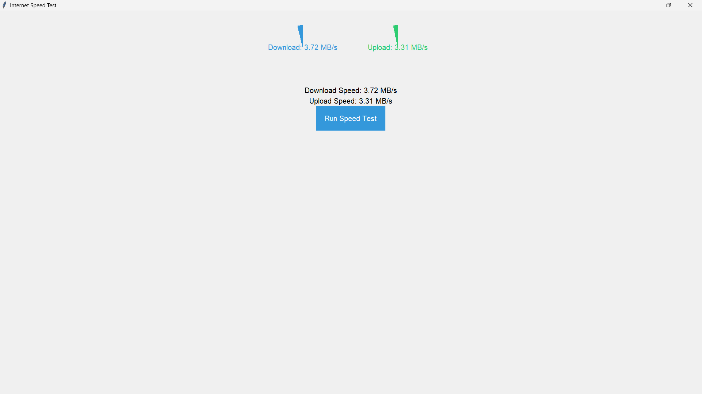

# Internet Speed Test App

This Python application provides a graphical representation of internet download and upload speeds using Tkinter for the GUI and the Speedtest library for speed measurements.

## Features

- Real-time display of download and upload speeds in MB/s.
- RPM meter-like structures to visualize speed.
- Rounded buttons and improved UI with a better color scheme and font.

## Requirements

- Python 3.x
- `tkinter` library (usually included with Python installations)
- `speedtest` library (install with `pip install speedtest-cli`)

## Usage

1. Clone the repository:

   ```bash
   git clone https://github.com/Hxrshrathore/internet-speed-test-app.git
   ```

2. Navigate to the project directory:

   ```bash
   cd internet-speed-test-app
   ```

3. Install the required libraries:

   ```bash
   pip install speedtest-cli
   ```

4. Run the application:

   ```bash
   python main.py
   ```

5. Click the "Run Speed Test" button to start measuring your internet speeds.

## Screenshots



## License

This project is licensed under the [MIT License](LICENSE).

## Acknowledgments

- Special thanks to the authors of the `speedtest-cli` library and the Tkinter library for making this project possible.